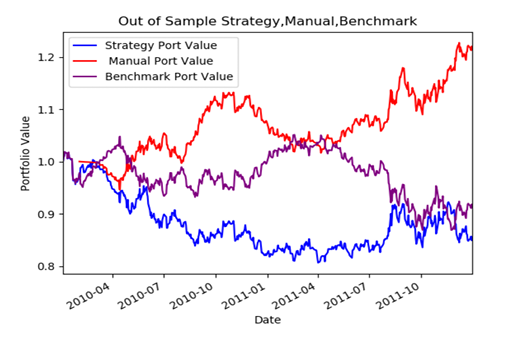

This experiment will compare return values between two Rl algorithms. Dyna-Q vs Monte Carlo Policy Gradient(REINFORCE). 

image1 - Simon J.D.Prince. Understanding Deep Learning. October 23, 2023 

For time saving purposes, the Dyan-Q performance will be obtained from an algorithm developed for Georgia Tech's 
CS 7646: Machine Learning for Trading. [Private Repository available upon request](https://github.com/carlosbarreraojeda-ai/ML4Trading.git)

image 2 - Strategy portfolio value (Dyna-Q) vs Manual(Technical Analysis trading rules), vs Benchmark(SNP 500).For in sample Data (roll forward cross validation data) 

image 3 - Strategy portfolio value (Dyna-Q) vs Manual(Technical Analysis trading rules), vs Benchmark(SNP 500).For out of sample Data (Test data) 

During the Dayna-Q training, a validation curve was utilized to evaluate the model. It was found that after 500+ epochs the model started 
to overfit and the validation curve started to lose profit while the training curve kept improving its portfolio value. A simple attempt at 
regularizing the model was implemented by early stopping but as seen in image 3, when ran against the testing set, the model was
not able to perform as well as it did during training. 

Additional regularization could be implemented, but after looking at the Q-table it only created 100 rows representing 100 states. 
Indicating at a possability that the data shown to the model was not varied enough to create enough states that were representative of the future 
environment(This hypothesis still needs to be tested, because underfitting would have been expected) 
